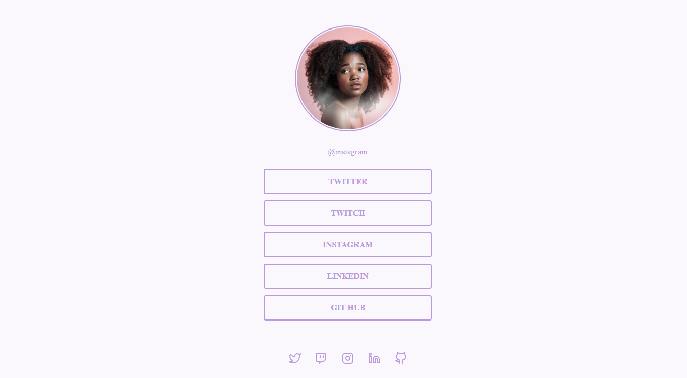

# Social Tree

Neste desafio foi criado uma página com uma lista de links (menu) que pode ser usada em perfis de redes sociais para direcionar o usuário para o local escolhido. Utilizando HTML e CSS.

[🔗 Clique aqui para acessar](https://gabrielli-lima.github.io/SocialTree/)

## 🛠️ Tecnologias
- HTML
- CSS